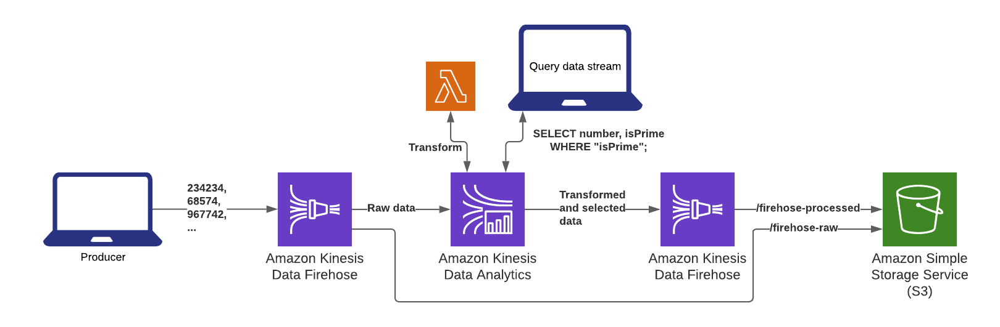

# Kinesis Firehose -> Kinesis Analytics Quickstart

## Requirements
- Terraform >= 0.13.0
- Python3.x
- GNU Make
- An AWS account with default credentials configured

## Deployment
- `terraform init`
- `make apply`
- `make stream # to send sample data`
  - Go to the AWS console and visit the SQL editor for your Kinesis Analytics Application.  This will start the analytics application.
 
 
After a few minutes, you can see the output of the firehoses in S3.

## Overview

This example illustrates how to configure Kinesis Analytics to query data from Kinesis Firehose.  The after deploying the infrastructure with Terraform and starting the Kinesis Analytics Application in the AWS console, the `make stream` command is used to send random integers to the firehose.  Python3.7 is used to transform the incoming data stream via an AWS Lambda Function as part of the Kinesis Analytics Application.  The file `app/handlers.py` can be used as an example for transforming Kinesis records with Python.  The Kinesis Analytics Application queries for prime numbers in the data stream and forwards these records to the output Kinesis Firehose in CSV format.  These records are stored in the destination S3 Bucket.

The AWS Lambda transformation is part of the Kinesis Analytics Application, rather than the input Kinesis Firehose, due to the fact that Kinesis Analytics pulls the untransformed records from Kinesis Firehose, rather than the transformed ones.  With this design, any transformations done via a Lambda Function in the input Kinesis Firehose would not persist in the Kinesis Analytics Application.
